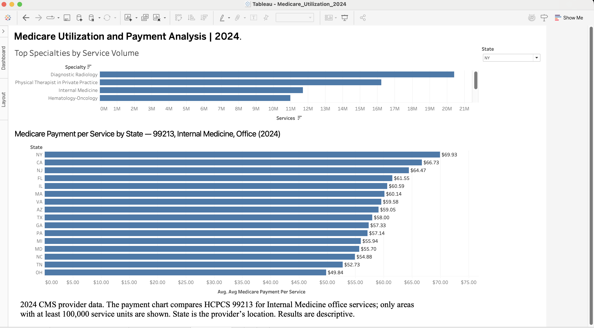
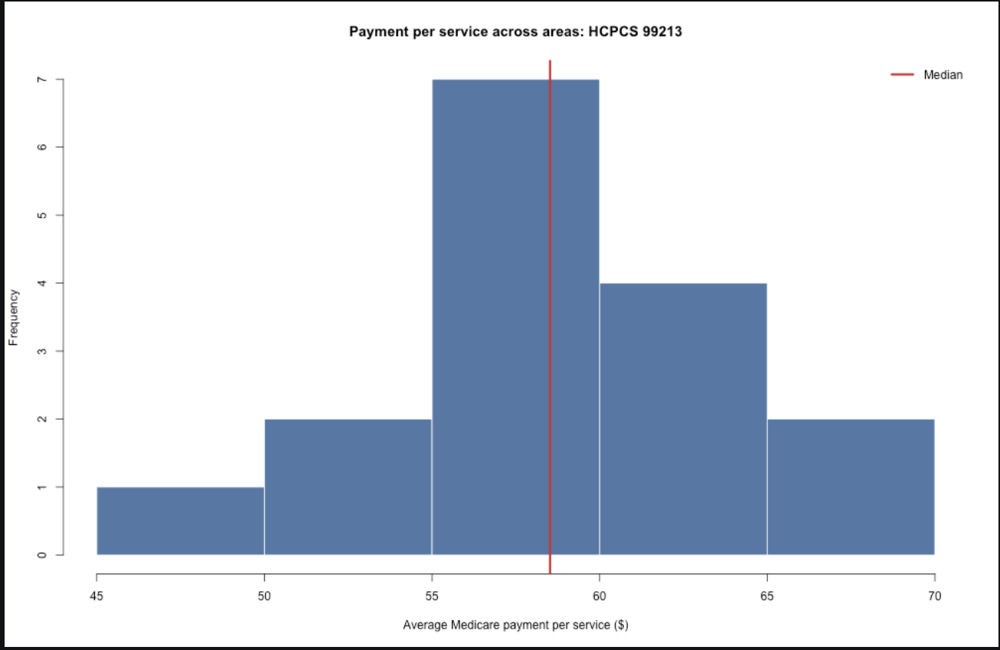

# Medicare Utilization and Payment Analysis (2024)

This project examines how Medicare service volume and average payments vary across provider specialties and locations. It uses the **2024 Medicare Physician & Other Practitioners — by Provider and Service** public dataset from the Centers for Medicare & Medicaid Services (CMS). The data summarize services furnished to Original Medicare fee-for-service Part B beneficiaries at the provider-and-service level. The analysis processes the large source file with Python, queries summarized results with SQLite, computes descriptive statistics with R, and presents the results in Tableau.

The project answers two practical questions: **Which specialties account for the most reported service units?** And **how does average Medicare payment vary by provider state when the service, specialty, and setting are held constant?** For the second question, it compares HCPCS **99213**, **Internal Medicine**, and **office** place of service. The results describe the published data; they do not establish why payments differ.

## Dashboard

The Tableau dashboard shows specialty service volume for the selected provider state (New York in this screenshot) and a separate payment comparison across qualifying states. The state selector applies to the specialty chart; the payment chart has its own data source and shows areas with at least 100,000 qualifying service units.



## Payment distribution

The R histogram summarizes average payment per 99213 service across the 16 areas meeting the service-volume threshold. The red line marks the median, **$58.52**.



## Key findings

- **Specialty volume:** Clinical Laboratory had approximately **304.4 million service units** nationally in the specialty summary. Service units are not unique patients or visits.
- **Comparable service:** The HCPCS 99213 analysis selected **38,403 provider-service rows** after filtering for Internal Medicine and office setting, spanning **59 states and areas** before the volume threshold.
- **Payment range:** Among the **16 areas** with at least 100,000 qualifying service units, New York had the highest service-weighted average Medicare payment (**$69.93**), and Ohio had the lowest (**$49.84**).
- **Distribution:** The median area-level average payment was **$58.52**; the 25th and 75th percentiles were **$55.88** and **$60.83**.
- **Exploratory association:** Spearman correlation between area service volume and average payment was **0.718** among these 16 areas. This does not imply that service volume causes payment differences.

## Methods

1. Download the 2024 provider-and-service CSV from [CMS Data](https://data.cms.gov/provider-summary-by-type-of-service/medicare-physician-other-practitioners).
2. Read the large CSV in chunks with Python and aggregate service units by provider state and specialty. Create a SQLite database and query the summaries.
3. Check for missing state, specialty, and HCPCS values, plus invalid or nonpositive service units and invalid or negative Medicare payment values.
4. Select HCPCS `99213`, provider type `Internal Medicine`, and office place of service `O`. For each provider state, calculate the service-weighted payment: `sum(Tot_Srvcs × Avg_Mdcr_Pymt_Amt) / sum(Tot_Srvcs)`.
5. In R, restrict the state/area summaries to at least 100,000 service units, calculate descriptive statistics and Spearman correlation, and generate the histogram.
6. Visualize specialty service volume and the same-service state payment comparison in Tableau.

## Data-quality checks

The Python checks read **9,781,673 source rows**. They found **zero** rows with missing state, specialty, or HCPCS, and zero rows with invalid or nonpositive service units or invalid or negative Medicare payment under the implemented rules. These checks cover the listed fields and rules only; they do not prove that every record is accurate. See `DATA_QUALITY.md` for the check definitions and output.

## Reproduce the analysis

Requirements: Python 3 with `pandas`, R, and Tableau Desktop for the interactive dashboard. From the project root:

```bash
python3 -m venv .venv
source .venv/bin/activate
python -m pip install pandas
```

Download the 2024 CMS CSV and put it in `data/` with the filename expected by `summarize.py` and `compare_service.py`. Then run:

```bash
python summarize.py
python analyze_sql.py
python quality_checks.py
python compare_service.py
Rscript r/analyze_payments.R
```

Open the saved Tableau workbook to explore the charts. The source CSV is approximately 3 GB and is obtained directly from CMS rather than stored in this repository. Generated summary files are in `output/`; the two images displayed here are in `docs/`.

## Interpretation and limitations

- CMS publishes aggregated provider-service records; service units do not represent distinct patients.
- Provider state is based on the provider location and need not match the beneficiary's residence.
- Specialty totals combine different HCPCS services, so their average payment levels should not be treated as like-for-like price comparisons.
- The 99213 comparison fixes the HCPCS code, specialty, and office setting, but is still descriptive and does not adjust for all factors affecting payment.
- The 100,000-unit threshold excludes smaller areas from the 16-area dashboard and R summary. The dataset and implemented quality checks have additional limits; consult the CMS methodology and data dictionary linked from its dataset page.
- The Tableau state filter in the screenshot controls the specialty chart, not the separate 99213 payment chart.

## Source

[CMS Medicare Physician & Other Practitioners datasets](https://data.cms.gov/provider-summary-by-type-of-service/medicare-physician-other-practitioners) — use the **2024 by Provider and Service** file, and consult the linked methodology and data dictionary. CMS is the source of the data; the analysis and visualizations in this repository are independent.
